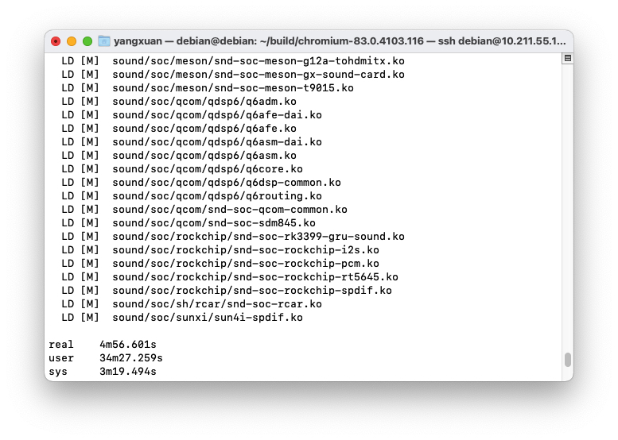
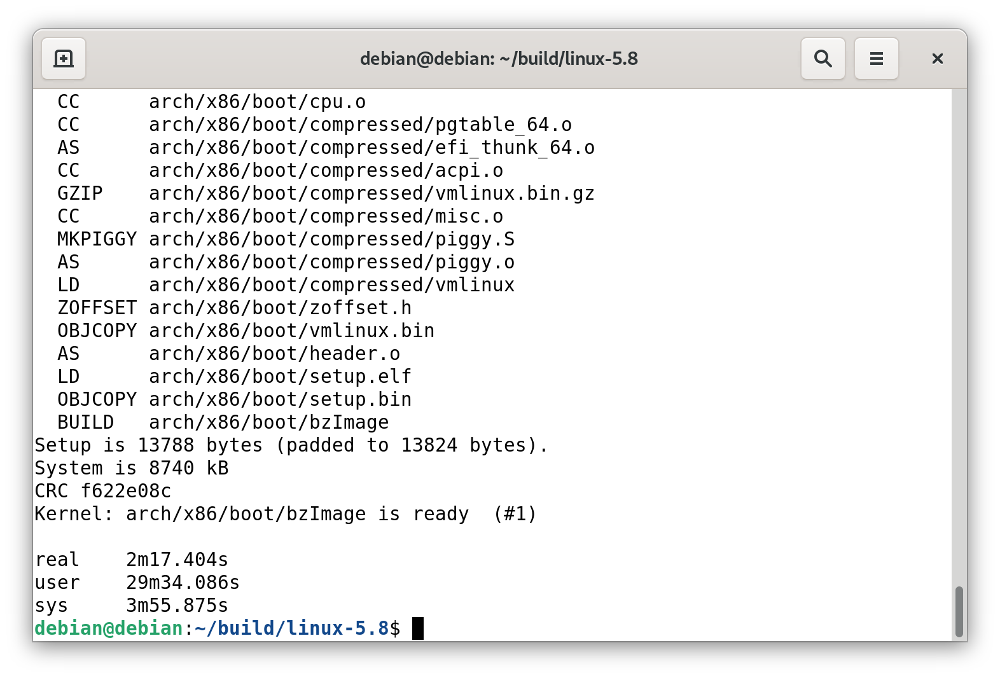
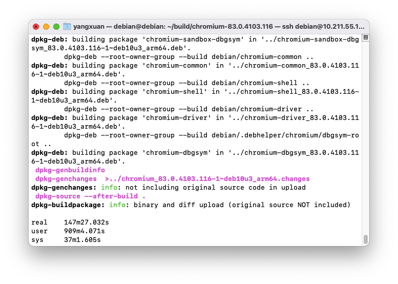
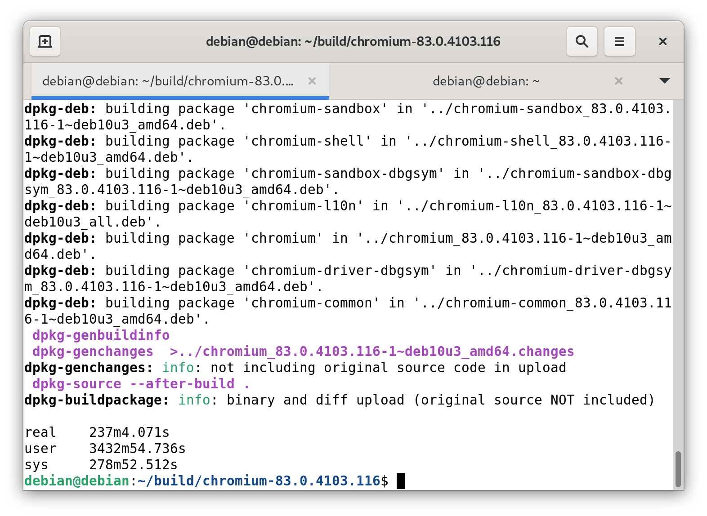
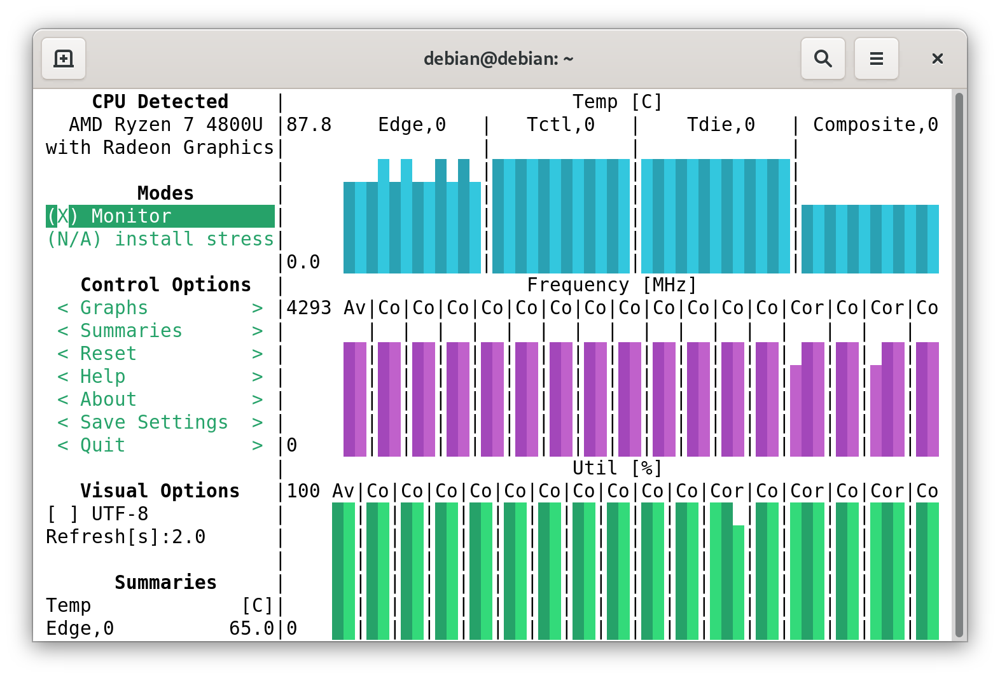
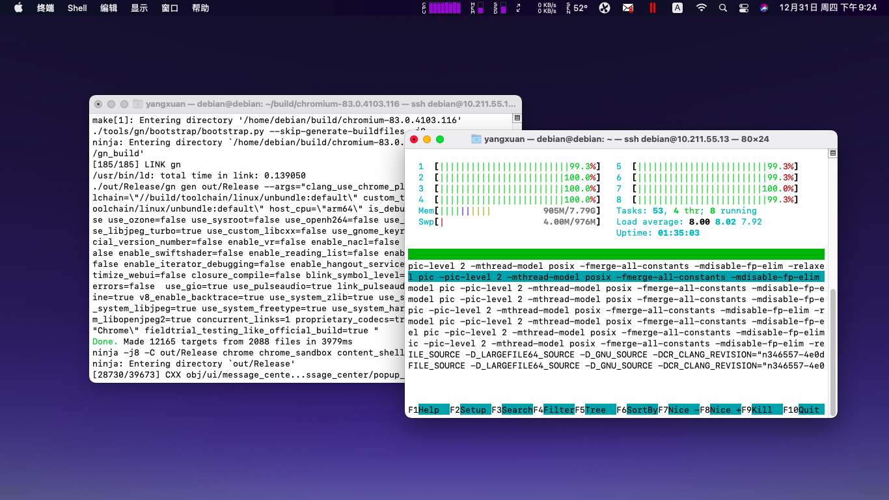
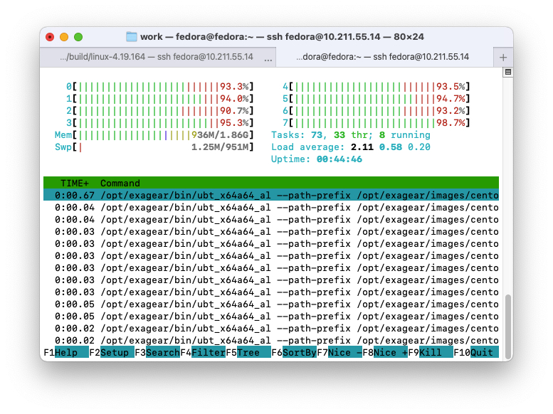
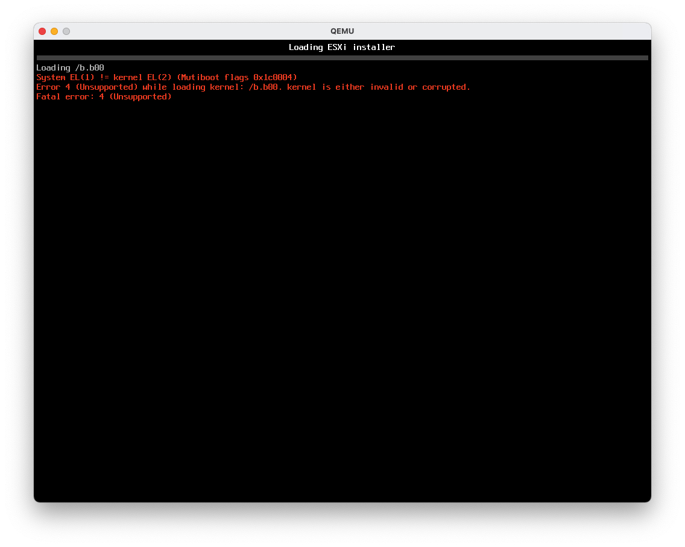
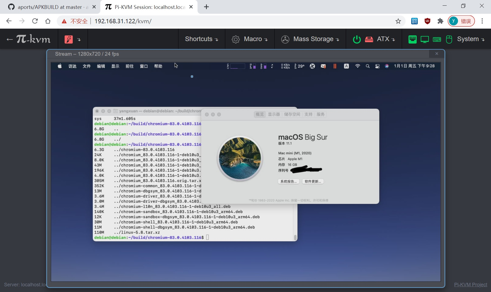

# use M1 as fast linux arm64 server

most screenshot was taken on moto Lapdock, which still work, but the resolution is kind of outdated ( only 1366*768 )

> Build environment: 
> 
> Mac Mini M1, Debian buster, Parallels Desktop, 8 core, 8G memory, 1G swap
> 
> 4800u, Debian buster, virt-manager, 16 core, 8G memory, 8G zram

- compile kernel ( 5.8, defconfig for their arch )

`time make -j$(nproc)`

it takes about 5 minutes

4800u take about 2 minutes

- compile chromium ( 83, deb )

`time dpkg-buildpackage -us -uc`

M1 is much faster on this

M1 use 147 minutes, 4800u use 237 minutes

and the temperature of 4800u is higher, actually even raspberry pi 4 is hotter than M1

M1 is also faster than ThunderX2 ( 96 core, 128G mem ), I remeber it take over 3 hours on old version. but slower than Huawei Kunpeng 920 ( 96 core, 128G mem ), I remeber it takes about 90 minutes.

- compile x86_64 kernel with exagear

time consumption is over 6 minutes compile 4.19 kernel

- esxi arm on qemu ( failed )

work with Pi-KVM

M1 cluster as build farm ( maybe OBS worker ) should work better than some arm server, cheap, fast, and much lower power consumption and heat generation
